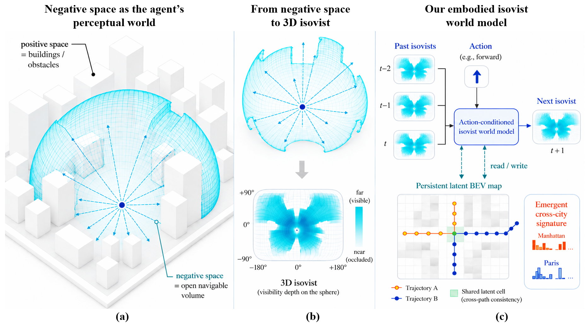

# A 3D Isovist World Model: Revealing a City's Unseen Geometry and Its Emergent Cross-City Signature

## Basic info

* Title: A 3D Isovist World Model: Revealing a City's Unseen Geometry and Its Emergent Cross-City Signature
* Authors: Xuhui Lin, Stephen Law, Nanjiang Chen, Kunyao Li, and Tao Yang
* Year: 2026
* Venue / source: arXiv
* Link: https://arxiv.org/abs/2606.03609
* Date surfaced: 2026-06-04
* Why selected in one sentence: It proposes negative-space geometry as the predictive state for embodied navigation instead of RGB appearance or flattened occupancy.

## Quick verdict

**Strong adjacent inspiration**

This is not a robotics-control paper in the usual VLA sense, but it is one of the cleaner recent papers on what an embodied world model should predict. The useful move is to model the open navigable volume around an agent as a 3D isovist, a spherical visibility-depth map, then predict how that geometry changes under movement. I inspected the arXiv HTML and PDF through the representation, architecture, experiments, spatial-map ablation, discussion, and caveats. Confidence is high on the mechanism and moderate on empirical strength because several claims are intentionally early-stage.

## One-paragraph overview

The paper argues that urban navigation world models should not predict building appearance. They should predict the geometry of the space an agent can move through. It encodes that space as a 3D isovist: a spherical depth map that records the nearest surface in every direction from the agent. The model predicts the next isovist from a short history of past isovists and a movement action, uses residual depth prediction to preserve sharp building edges, and adds a persistent latent bird's-eye-view map keyed by world coordinates for cross-path consistency. Its headline result is that a city-blind model trained on Manhattan and Paris develops temporal latents from which city identity is linearly decodable better than single-frame baselines.

## Model definition

### Inputs
The model takes a short sequence of past 3D isovists and a movement action. Each isovist is a spherical visibility-depth map over azimuth and elevation, representing the distance to the nearest surface in each direction. The model also reads from a persistent latent BEV spatial map at the current world coordinate.

### Outputs
It predicts the next 3D isovist. Accumulated predicted isovists can be converted back into positive-space surface evidence, making building facades appear as high-density ridges around the traversed negative space.

### Training objective (loss)
The model is trained for next-isovist prediction, using residual depth prediction and self-rollout scheduled sampling. The scheduled-sampling trick replaces some ground-truth context with the model's own prediction, keeping the corrupted context on the valid geometry manifold rather than blurring depth maps across sharp discontinuities.

### Architecture / parameterization
The architecture combines a depth CNN and anchor-frame encoder, an arc-length-indexed Transformer over the path history, a residual depth decoder, and a persistent latent BEV map. The BEV map is read and written at world coordinates so independently sampled paths crossing the same place can share latent spatial memory.

## Key questions this summary must address

### 1. What problem is the paper trying to solve?
It is trying to define a better predictive target for embodied navigation through cities. RGB prediction carries lighting and appearance baggage. Bird's-eye-view occupancy is geometry-oriented but collapses the third dimension. The paper argues that an agent should model the open volume it can perceive and traverse.

### 2. What is the method?
The method converts OpenStreetMap-derived city geometry into ray-cast sequences of 3D isovists along pedestrian paths. It trains a model to predict the next isovist from recent isovists and motion. A persistent writable BEV latent map lets paths that cross the same cell read and write shared memory, providing a mechanism for cross-path geometric consistency.

### 3. What is the method motivation?
The motivation is that negative space is closer to the navigational state than building texture. What matters to an embodied agent is where open space, occlusion, edges, corridors, and junctions are, and how those change after movement. Isovists encode that directly and preserve vertical structure that flattened occupancy loses.

### 4. What data does it use?
The paper builds a reproducible OpenStreetMap-based dataset for Manhattan and Paris. It ray-casts isovist sequences along intersection-anchored pedestrian paths so independently sampled paths share mid-route locations. The authors explicitly note a height-provenance issue, especially Paris height imputation, which matters for interpreting the city-signature result.

### 5. How is it evaluated?
It evaluates single-step isovist prediction against a copy-last baseline, probes whether temporal latents from a city-blind model encode city identity, shows that accumulated negative-space predictions recover positive-space surface evidence, and runs a preliminary spatial-map consistency ablation on a synthetic four-way intersection.

### 6. What are the main results?
On single-step prediction, the model improves over copy-last on MAE (3.57 vs. 4.36 meters), RMSE (11.34 vs. 13.80 meters), and edge-F1 (0.719 vs. 0.689), while roughly tying on SSIM. For the city-signature probe, the world-model temporal latent reaches 89.3 percent accuracy, compared with 78.5 percent for raw pooled pixels and 69.4 percent for single-frame global statistics. The spatial-map ablation improves all four reported consistency metrics, but only on four synthetic crossing pairs, so it should be read as a proof of concept.

### 7. What is actually novel?
The novelty is the predictive representation. The paper turns isovists from a descriptive architecture and spatial-cognition tool into the state of an embodied world model. The persistent writable BEV map is also important because it gives the model an explicit substrate for cross-path memory rather than relying only on sequence latents.

### 8. What are the strengths?
- The representation target is unusually clear.
- Negative-space prediction removes photometric clutter without flattening 3D geometry.
- The paper is honest about what the cross-city signature does and does not prove.
- The writable map is a concrete memory mechanism.
- The released OSM-based pipeline makes the setup more reproducible than many urban-world-model claims.

### 9. What are the weaknesses, limitations, or red flags?
- The city-signature result is binary Manhattan-versus-Paris, not a broad urban-generalization claim.
- Height provenance, especially imputed Paris heights, may contribute to the separability.
- The spatial-map consistency ablation is tiny and synthetic, so it is not yet strong evidence.
- There is no downstream robot policy or planning evaluation showing that the representation improves action.
- Isovist prediction is navigation-adjacent, not directly applicable to manipulation without translation.

### 10. What challenges or open problems remain?
The open problem is connecting this representation to actual planning and control. The paper makes a strong case that negative-space geometry is a better state target, but it still needs larger multi-city validation, stronger map-consistency tests, and downstream navigation tasks where the representation improves decisions.

### 11. What future work naturally follows?
- Evaluate isovist world models on multi-city navigation and localization tasks.
- Validate the persistent spatial map on real crossing paths, not just synthetic pairs.
- Combine negative-space geometry with semantic affordances and uncertainty.
- Test whether similar spherical visibility-state targets help robots in indoor or aerial navigation.

### 12. Why does this matter for cabbageland?
Because it is a useful reminder that the best world-model target may not be the prettiest one. If the agent's job is navigation, the state should expose navigable geometry, occlusion, and path structure. The paper's negative-space framing is a good antidote to appearance-first world modeling.

### 13. What ideas are steal-worthy?
- Predict the state variable the agent actually needs, not the richest sensory stream.
- Use residual geometry prediction to preserve sharp structural edges.
- Keep persistent spatial memory explicitly keyed by world coordinates.
- Treat accumulated perception of open space as evidence about positive-space structure.

### 14. Final decision
**Keep as adjacent representation inspiration.** The empirical base is still narrow, but the state choice is clean enough to be useful for future world-model and spatial-memory thinking.

## Key figures from HTML

### Figure 1

Caption summary: Negative space as the agent's perceptual world. As an embodied agent moves through a city, it perceives the open navigable volume between buildings rather than the buildings themselves. This volume is encoded as a 3D isovist, a spherical visibility-depth map over azimuth and elevation. The model predicts the next isovist from recent isovists and movement, while reading from and writing to a persistent latent BEV map keyed by world coordinates.
