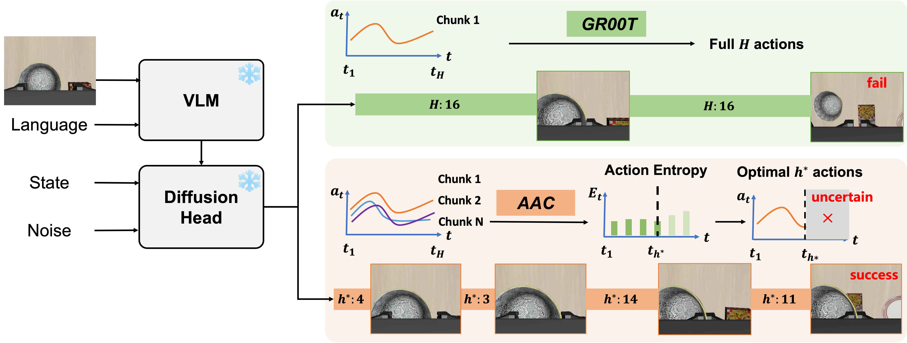

# Adaptive Action Chunking at Inference-time for Vision-Language-Action Models

## Basic info

* Title: Adaptive Action Chunking at Inference-time for Vision-Language-Action Models
* Authors: Yuanchang Liang, Xiaobo Wang, Kai Wang, Shuo Wang, Xiaojiang Peng, Haoyu Chen, David Kim Huat Chua, Prahlad Vadakkepat
* Year: 2026
* Venue / source: arXiv / CVPR 2026
* Link: https://arxiv.org/abs/2604.04161
* Date surfaced: 2026-04-07
* Why selected in one sentence: It turns an annoyingly under-discussed VLA inference knob — chunk size — into an explicit uncertainty-conditioned decision rule instead of a fixed convention.

## Quick verdict

* Useful

This is not a grand conceptual leap, but it is exactly the sort of practical mechanism paper that can quietly matter. Fixed action chunk sizes are obviously task- and phase-dependent, and the paper offers a lightweight way to vary them at inference time without retraining the policy. The main question is how robust the entropy heuristic remains outside the specific evaluated setup.

## One-paragraph overview

The paper argues that VLA policies with diffusion or flow-matching action heads suffer from a basic inference tradeoff: long action chunks improve consistency and throughput but hurt responsiveness, while short chunks improve reactivity but can create jerky mode-jumping behavior. Instead of choosing one global chunk size, the authors compute action entropy from multiple candidate action chunks at inference time and adaptively choose the horizon based on where average entropy changes most sharply, with a lower bound to avoid pathological tiny chunks. Conceptually, this is just making uncertainty do real scheduling work.

## Model definition

### Inputs
The underlying policy takes standard VLA inputs: vision, language, and robot state. AAC additionally uses multiple sampled candidate action chunks from the policy at the current timestep in order to estimate entropy over translation, rotation, and discrete gripper control.

### Outputs
The base model outputs an action chunk. AAC outputs an inferred chunk length h-star and executes the first h-star actions from the predicted chunk before replanning.

### Training objective (loss)
AAC itself is inference-time only and requires no additional training. The underlying baseline in the paper is GR00T N1.5 with a flow-matching objective for action prediction.

### Architecture / parameterization
Not a new end-to-end policy architecture so much as an inference controller layered on top of a diffusion or flow-matching VLA policy. In the paper's implementation, the base policy is GR00T N1.5.

## Key questions this summary must address

### 1. What problem is the paper trying to solve?
VLA models often rely on action chunking, but papers usually pick one fixed chunk length at inference time. That creates a brittle tradeoff between responsiveness and consistency, and the best value varies across tasks and even within different phases of the same task.

### 2. What is the method?
At each timestep, AAC samples multiple candidate action chunks, estimates entropy across the continuous and discrete action dimensions, computes the average entropy for different possible chunk lengths, and chooses the chunk size at the maximum differential point, subject to a minimum chunk-size floor.

### 3. What is the method motivation?
If the policy is uncertain, the system should commit to fewer future actions and replan sooner. If it is confident, it can safely execute a longer chunk. That is an extremely natural control idea, yet many VLA systems still hard-code one chunk length for every situation.

### 4. What data does it use?
The paper fine-tunes and evaluates on RoboCasa and LIBERO in simulation, then also reports real-world experiments. The accessible text emphasizes GR00T N1.5 fine-tuning on benchmark-specific demonstrations and evaluation over many rollouts per task.

### 5. How is it evaluated?
It compares AAC against vanilla GR00T and GR00T with different fixed inference chunk sizes across RoboCasa and LIBERO task suites, plus real-world manipulation settings. That is the correct baseline family because the claim is about inference-time chunk selection.

### 6. What are the main results?
The paper reports consistent but modest average gains over fixed-size inference, including a stronger improvement on harder long-horizon settings such as LIBERO-Long. The qualitative plot showing larger chunks during transport and smaller chunks during delicate manipulation is probably the most intuitively convincing evidence.

### 7. What is actually novel?
Mostly the framing and a usable heuristic: treat chunk size as a per-step uncertainty-conditioned decision instead of a global hyperparameter. It is not a foundational new architecture, but it is a decent systems-level correction to a lazy convention.

### 8. What are the strengths?
No retraining required. Easy to graft onto existing diffusion-style VLA systems. Baselines are mostly appropriate. And the method targets a genuine inference-time weakness that many papers wave away with tuned constants.

### 9. What are the weaknesses, limitations, or red flags?
The entropy rule could be more heuristic than principled, and it depends on multiple candidate chunk samples, which adds compute at inference. The reported gains are useful rather than dramatic. Also, because the method is tuned around chunk-length selection, it may mostly regularize a weakness of the chosen baseline rather than reveal a universally strong principle.

### 10. What challenges or open problems remain?
A better theoretical account of how chunk length should relate to policy uncertainty, embodiment, and task phase. More validation across stronger open and closed VLA baselines. And a cleaner connection between chunk scheduling and explicit subgoal structure.

### 11. What future work naturally follows?
Learning chunk schedules directly, connecting chunk adaptation to explicit event or subgoal boundaries, and combining uncertainty-based chunking with regime-switching controllers or planners.

### 12. Why does this matter for cabbageland?
Because it is a reminder that some supposed model improvements are really hidden inference-policy decisions. If we care about mechanism clarity, chunk scheduling should be treated as part of the system design, not background tuning sludge.

### 13. What ideas are steal-worthy?
Treat execution horizon as a first-class control variable. Use uncertainty to decide when to replan. Plot phase-dependent chunk lengths as a diagnostic for whether a manipulation system's control policy makes semantic sense.

### 14. Final decision
Keep as a practical note and possible implementation trick, not as a major conceptual anchor. Useful if we touch VLA inference or evaluation; not something I would center a research direction around by itself.

### Figure 1

Caption-level takeaway: the whole contribution is basically this diagram — estimate action entropy from candidate chunks, then let that decide how long the system commits before replanning.
