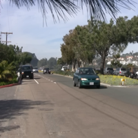

# A Frame is Worth One Token: Efficient Generative World Modeling with Delta Tokens

## Basic info

* Title: A Frame is Worth One Token: Efficient Generative World Modeling with Delta Tokens
* Authors: Tommie Kerssies, Gabriele Berton, Ju He, Qihang Yu, Wufei Ma, Daan de Geus, Gijs Dubbelman, Liang-Chieh Chen
* Year: 2026
* Venue / source: arXiv / CVPR 2026
* Link: https://arxiv.org/abs/2604.04913
* Date surfaced: 2026-04-07
* Why selected in one sentence: It proposes an actually meaningful structural compression for generative world modeling by representing inter-frame semantic change as one delta token rather than predicting dense spatial token grids.

## Quick verdict

* Highly relevant

This is one of the stronger recent world-model papers because the compression idea is not decorative: it materially changes the compute shape of the forecasting problem. The core bet is that for planning-relevant future prediction, modeling semantic change matters more than regenerating full dense frames. The paper also avoids a common trap by pairing efficiency claims with a plausible diversity mechanism rather than quietly reverting to deterministic prediction.

## One-paragraph overview

The paper starts from a VFM-feature forecasting setup instead of pixel generation, then asks whether even that feature-space representation is still too spatially redundant for generative future prediction. Their answer is DeltaTok, a tokenizer that encodes the difference between consecutive VFM feature maps into a single continuous token, plus DeltaWorld, a predictor trained with a best-of-many objective so multiple plausible futures can be generated in one forward pass. The interesting part is not just that it is smaller; it changes the prediction unit from "future frame contents everywhere" to "what changed semantically since the last frame," which is a much more defensible object if the downstream task is segmentation or depth forecasting rather than photorealistic video.

## Model definition

### Inputs
The model takes a short context of past video frames, encoded by a frozen vision foundation model into feature maps. DeltaTok conditions on consecutive feature maps to produce one delta token per frame, and DeltaWorld conditions on the sequence of past delta tokens plus timestamps and sampled noise queries.

### Outputs
DeltaTok outputs a single continuous token representing the change from one frame's VFM features to the next. DeltaWorld outputs predicted future delta tokens, which can then be decoded back into future VFM feature maps for downstream dense forecasting tasks like segmentation and depth estimation.

### Training objective (loss)
The tokenizer is trained with reconstruction loss on VFM feature maps. The world model uses a Best-of-Many objective: multiple candidate futures are generated from different noise queries, and only the hypothesis closest to ground truth is supervised. The accessible text describes smooth L1 loss in the underlying DINO-world setup and MSE-style reconstruction loss for tokenization.

### Architecture / parameterization
A hybrid stack: frozen VFM backbone, transformer-based tokenizer encoder/decoder, and a transformer future predictor operating over a purely temporal sequence of delta tokens rather than a dense spatial token grid.

## Key questions this summary must address

### 1. What problem is the paper trying to solve?
Generative world models are still expensive because they usually predict dense spatial representations and need multiple forward passes per future sample. Even feature-space world models often remain discriminative, which means they collapse multiple futures into one average-looking guess. The paper wants diverse future prediction without the usual token and FLOP explosion.

### 2. What is the method?
First, it trains DeltaTok to encode the semantic difference between consecutive VFM feature maps into one token. Second, it trains DeltaWorld to predict future delta-token sequences instead of future spatial feature maps. Third, it uses Best-of-Many training so many futures can be proposed in parallel and only the closest one is supervised, enabling diverse one-pass sampling at inference.

### 3. What is the method motivation?
Most adjacent frames share a huge amount of redundant structure. If the model can condition on the previous frame and just predict the meaningful change, the future-modeling problem becomes much smaller. The delta representation also gives a decent inductive bias: predicting no change preserves the previous state, so the model focuses on explaining actual dynamics rather than regenerating the whole world every step.

### 4. What data does it use?
The paper trains on a large multi-domain video collection of roughly four million samples, then evaluates on dense forecasting benchmarks using VSPW and Cityscapes for segmentation and KITTI for monocular depth. From accessible text, this is an unseen-evaluation-dataset setup rather than an in-domain toy benchmark.

### 5. How is it evaluated?
It is evaluated on short-term and mid-term dense forecasting, using future VFM features decoded into segmentation and depth predictions. The paper reports both best-of-samples and mean-over-samples behavior, which is the right move for a generative world model: a strong best score alone could just mean noisy diversity.

### 6. What are the main results?
The headline claim is that DeltaWorld beats prior generative baselines on alignment with real future outcomes while using over 35 times fewer parameters and around 2,000 times fewer FLOPs than existing generative world models. The paper also claims average predictions competitive with discriminative and generative baselines, which matters because otherwise the diversity could just be random junk.

### 7. What is actually novel?
The real novelty is not merely "compress more." It is the specific shift from frame-token modeling to delta-token modeling in VFM feature space, plus pairing that representation with one-pass Best-of-Many future generation. The result is a generative world model whose computational object is a temporal sequence of semantic changes instead of a spatiotemporal tensor of future content.

### 8. What are the strengths?
The mechanism is clean and easy to reason about. It attacks a real bottleneck instead of hiding cost inside a giant video model. It also seems transfer-friendly: the delta-token idea could plausibly matter anywhere future prediction happens in semantically meaningful feature space. The evaluation framing is also healthier than average because it measures both best and mean sample quality.

### 9. What are the weaknesses, limitations, or red flags?
The paper still lives in dense forecasting benchmarks rather than downstream planning loops, so some of the practical world-model value remains inferred rather than demonstrated. The accessible text suggests the model is trained on a large proprietary-scale video corpus, which may make reproduction harder. Also, best-of-many training can sometimes hide mode allocation pathologies; I would want to know how diverse and well-calibrated the sample set really is beyond benchmark metrics.

### 10. What challenges or open problems remain?
It is still unclear how well this tokenization behaves for action-conditioned futures, contact-rich embodied environments, or very abrupt scene changes where "delta" is almost equivalent to re-encoding the whole scene. There is also an open question about whether these delta tokens become a useful latent state for planning, not just forecasting.

### 11. What future work naturally follows?
The obvious next steps are action-conditioned DeltaWorld variants, planner-facing latent control on top of delta tokens, and tests in embodied or interactive settings where the future depends on interventions rather than passive video continuation.

### 12. Why does this matter for cabbageland?
Because it is exactly the sort of paper that replaces mush with an explicit state abstraction. If we care about controllable world models, planning, or structured prediction, a compact semantic-delta state is much more interesting than yet another huge spatiotemporal generator.

### 13. What ideas are steal-worthy?
One-token-per-transition representations. Delta-style latent states for planning. Evaluating generative predictors with both best and mean behavior. More broadly: define the prediction target around state change, not full-frame re-synthesis, whenever the task allows it.

### 14. Final decision
Preserve and revisit. This is a real mechanism paper, not just a benchmark increment, and it may be useful both for model design and for how future work is framed.

### Figure 1

Caption-level takeaway: the paper's central move is to collapse future modeling from dense spatiotemporal token prediction into one temporal delta token per step, which is why the efficiency claim is not just optimizer seasoning.
