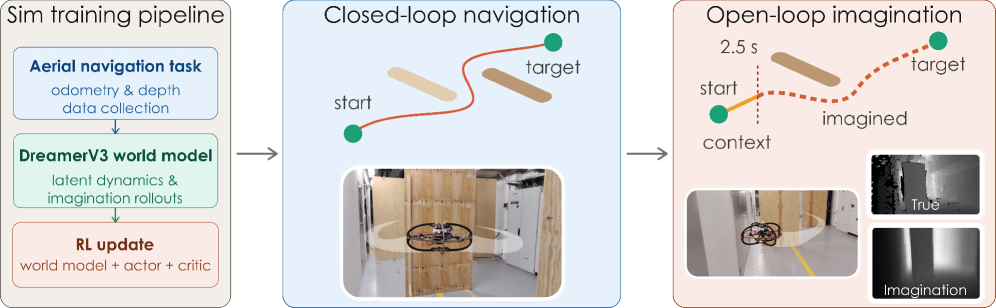

# Generalization of World Models under Environmental Variability for Vision-based Quadrotor Navigation

## Basic info

* Title: Generalization of World Models under Environmental Variability for Vision-based Quadrotor Navigation
* Authors: Luca Zanatta, Grzegorz Malczyk, and Kostas Alexis
* Year: 2026
* Venue / source: arXiv
* Link: https://arxiv.org/abs/2606.05015
* Date surfaced: 2026-06-04
* Why selected in one sentence: It shows that cross-environment predictive robustness during world-model pretraining can be a better sim-to-real signal than simulated RL policy success.

## Quick verdict

**Highly relevant as evaluation discipline**

This is not a new generalist VLA architecture, but it is exactly the kind of deployment sanity check world-model papers need. The most useful result is negative in the right way: the model that dominated simulation policy evaluation failed in a harder real-world deployment, while the models with stronger cross-environment reconstruction during self-supervised pretraining transferred. I inspected the arXiv HTML and PDF, including the method, cross-environment protocol, real-world deployment section, limitations, and appendix real-world trial table. Confidence is high on the central result and its caveats.

## One-paragraph overview

The paper studies DreamerV3-style world models for depth-based quadrotor navigation under environmental variability. Instead of training one model in one simulator layout and celebrating success, it creates four environment-randomness levels, trains world models under each, cross-evaluates them during self-supervised pretraining and RL fine-tuning, then deploys all of them on a real quadrotor. The standout finding is that self-supervised cross-environment reconstruction quality predicts real deployability better than the simulated RL win rate. It also includes a striking open-loop run where the robot receives 2.5 seconds of real sensory input and then flies a 12 meter traverse on imagined depth and state alone.

## Model definition

### Inputs
The agent observes onboard depth images and proprioceptive state, including position, velocity, rotation, and angular velocity. It also receives a goal position. During the open-loop deployment, the world model receives a short real-observation context before rolling out imagined observations and state.

### Outputs
The world model predicts latent dynamics, reconstructed depth observations, state, and reward-relevant quantities. The policy outputs velocity and yaw-rate commands for collision-free navigation.

### Training objective (loss)
The system uses DreamerV3's recurrent state-space world model. During self-supervised pretraining, it optimizes reconstruction and latent dynamics objectives for depth and state prediction. During RL fine-tuning, the actor and critic are optimized in latent imagination. I did not audit every DreamerV3 loss coefficient, but the training phases and validation logic are clear.

### Architecture / parameterization
The model is a DreamerV3-style recurrent state-space model with deterministic recurrent state and categorical stochastic latent state. The paper studies the effect of environment randomness and hyperparameters such as discrete latent size and training-sequence length, rather than proposing a new backbone.

## Key questions this summary must address

### 1. What problem is the paper trying to solve?
It is trying to understand whether learned world models for vision-based robot navigation actually generalize across environment shifts. The practical question is: which validation signal should decide whether a world model is likely to transfer to real hardware?

### 2. What is the method?
The authors train world models in four simulated environment-randomness regimes, from fixed obstacle layout to fully randomized obstacle, spawn, and goal positions. They evaluate each model across all regimes during self-supervised pretraining, then fine-tune policies in imagination and evaluate cross-environment RL performance. Finally, they deploy every trained model on a real quadrotor in closed-loop and open-loop settings.

### 3. What is the method motivation?
The motivation is that simulation success can be misleading. A policy may exploit the training distribution while the learned predictive representation remains brittle. If world models are supposed to support deployable embodied control, their imagined observations should stay meaningful under environment shift.

### 4. What data does it use?
The training data comes from AerialGym simulation under four environment-randomness levels. The environment is an indoor navigation setup with cuboid obstacles, varied spawn and goal positions, and trajectories collected by several exploration strategies. Real deployment uses a quadrotor in unseen indoor corridor-like settings with panel obstacles, including five-panel and seven-panel configurations.

### 5. How is it evaluated?
The paper evaluates self-supervised reconstruction across environment levels, simulated RL win/crash/timeout rates, closed-loop real-world navigation, and open-loop real-world imagination. The real-world table reports repeated trials for each trained model across five-panel, seven-panel, and imagination conditions.

### 6. What are the main results?
In the harder seven-panel real deployment, WM1 and WM2 succeeded in all four trials, WM4 succeeded in three of four with one crash, and WM3 failed to reach the target in all four trials by looping until timeout. This is important because WM3 had dominated the simulation policy evaluation. In the open-loop imagination test, all models completed two of two runs after a 2.5 second real context window, flying on imagined observations over a 12 meter traverse. The authors' central claim is that SSL cross-environment reconstruction quality was the better deployability predictor.

### 7. What is actually novel?
The novelty is the evaluation protocol and deployment comparison, not a new world-model architecture. The paper isolates a useful validation principle: before trusting a world model for real robot deployment, test whether its predictive state generalizes across environment variation, not just whether a policy trained in its imagination wins in simulation.

### 8. What are the strengths?
- It connects simulation metrics to real hardware instead of stopping at simulator success.
- It catches a real model-selection failure: the simulation winner fails in deployment.
- The open-loop imagination run is a concrete stress test of latent dynamics.
- The limitations are stated plainly, especially obstacle simplicity and horizon length.
- The paper gives practical knobs, especially discrete latent size and training-sequence length.

### 9. What are the weaknesses, limitations, or red flags?
- The real-world obstacles are panel-like, planar, and close to the simulated geometry family.
- The open-loop result is impressive, but the useful imagination horizon is still brief and degradation is visible over time.
- The study is depth-based navigation, not manipulation, semantics, or contact-rich world modeling.
- The randomness regimes are meaningful but still narrow compared with real-world visual and physical variation.

### 10. What challenges or open problems remain?
The next challenge is whether the same validation principle holds for richer observations, thinner obstacles, dynamic objects, semantic goals, and contact-rich manipulation. The field also needs metrics that identify when imagined rollouts remain action-relevant rather than merely reconstructing plausible sensory streams.

### 11. What future work naturally follows?
- Apply cross-environment SSL validation to manipulation and mobile-manipulation world models.
- Combine predictive robustness metrics with uncertainty estimates before deployment.
- Stress-test learned imagination on thin structures, small objects, dynamic scenes, and longer horizons.
- Use this protocol as a pre-deployment gate for model-based robot learning papers.

### 12. Why does this matter for cabbageland?
Because it gives a concrete antidote to simulator leaderboard seduction. If a world model is supposed to support real action, the question is not just whether the policy trained inside it wins. The question is whether the predictive representation survives the shifts that deployment will actually impose.

### 13. What ideas are steal-worthy?
- Treat self-supervised cross-environment reconstruction as a world-model selection criterion.
- Compare model selection by predictive robustness against selection by simulated policy return.
- Include real hardware failures in the story instead of hiding them as outliers.
- Use open-loop imagination as a diagnostic, but report its horizon limits explicitly.

### 14. Final decision
**Keep as evaluation ammunition.** This paper is useful less for architecture and more for the standard it sets: a deployable world model needs predictive robustness under shift, not just simulator reward.

## Key figures from HTML

### Figure 1

Caption summary: From simulation to real-world closed- and open-loop deployment.
