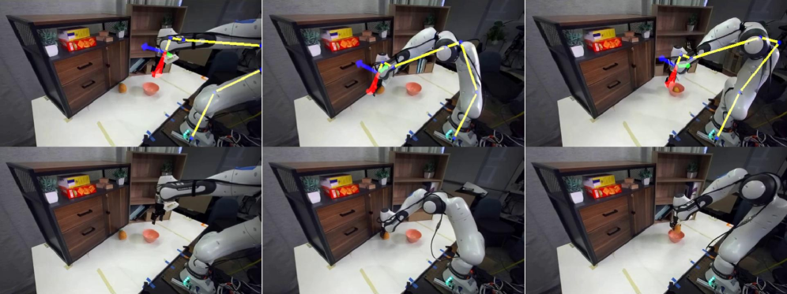

# OSCAR: Omni-Embodiment Action-Conditioned World Model for Robotics

## Basic info

* Title: OSCAR: Omni-Embodiment Action-Conditioned World Model for Robotics
* Authors: Zhuoyuan Wu and Jun Gao
* Year: 2026
* Venue / source: arXiv
* Link: https://arxiv.org/abs/2606.04463
* Date surfaced: 2026-06-04
* Why selected in one sentence: It makes generated robot rollouts useful for policy evaluation by giving the video world model a spatially aligned, cross-embodiment action interface.

## Quick verdict

**Highly relevant**

This is one of the better recent robot world-model papers because it treats generation as an evaluation tool, not just as a source of impressive video samples. The key mechanism is 2D kinematic skeleton rendering: actions are converted into a texture-free spatial condition that can describe Franka, KUKA, Toyota HSR, AgiBot, and human-hand motion without binding the model to one robot mesh. I inspected the arXiv HTML and PDF, including the data pipeline, conditioning ablations, policy-evaluation protocol, appendix metric definitions, and stated limitations. Confidence is high on the main mechanism and evaluation setup. The main uncertainty is how much to trust the generated-rollout scoring stack as a replacement for human real-world evaluation.

## One-paragraph overview

OSCAR finetunes Cosmos-Predict2.5-2B into an action-conditioned video world model for robotics. It starts from a first RGB frame and a future action trajectory rendered as a 2D kinematic skeleton, then generates the corresponding robot video rollout. The authors build a curated and deduplicated dataset from robotics and egocentric human videos, arguing that skeleton conditioning lets human-hand interaction clips provide useful motion and scene diversity. The strongest application is virtual policy evaluation on RoboArena: generate rollouts for candidate policies, score success with a calibrated vision-language evaluator, and compare policy rankings against real-world RoboArena results.

## Model definition

### Inputs
The model takes the first RGB frame and a sequence of rendered 2D skeleton conditions derived from future robot or human kinematics. For policy evaluation, it also depends on estimated camera intrinsics/extrinsics and the given robot action trajectory from RoboArena.

### Outputs
It outputs a future video rollout conditioned on the initial scene and action sequence. In the RoboArena evaluation setup, those generated videos are then scored for task success and policy ranking.

### Training objective (loss)
The backbone uses the Cosmos-Predict2.5 rectified-flow video diffusion objective in VAE latent space. The model predicts the velocity field between noisy and target video latents, conditioned on the first frame and skeleton-render latent. I did not inspect every weighting constant, but the main objective and conditioning path are clear from the method section.

### Architecture / parameterization
The architecture is a Cosmos-Predict2.5-2B video DiT with a WAN-style VAE. Skeleton videos are encoded and injected as action conditions. The core design choice is not a novel DiT block; it is the interface: 2D kinematic skeleton renderings give pixel-aligned action information while staying mostly independent of robot texture and embodiment-specific geometry.

## Key questions this summary must address

### 1. What problem is the paper trying to solve?
It is trying to make action-conditioned video world models precise enough and general enough to serve as robot policy evaluation proxies. Existing latent-action world models can transfer across embodiments but often follow action imprecisely. Dense mesh or pointmap renderings can be precise but are tied to specific robot geometry and can overfit to appearance.

### 2. What is the method?
The method converts robot or hand kinematics into 2D skeleton renderings aligned with the camera view. A video diffusion model sees the first RGB frame plus the skeleton action condition and predicts the resulting rollout. The data pipeline filters noisy large-scale robot and egocentric video sources for length, static cameras, meaningful action, visible skeletons, and semantic diversity. For policy evaluation, the system generates rollouts from real RoboArena initial frames and candidate policy actions, then scores those videos and compares the induced ranking to real RoboArena outcomes.

### 3. What is the method motivation?
The motivation is that action conditioning needs to be explicit enough for frame-level and pixel-level action following, but generic enough to work across robot arms and human hands. Skeletons are a good compromise: they expose motion and gripper state without requiring robot-specific textures or full meshes.

### 4. What data does it use?
The paper starts from 2,165,359 source videos and filters them to 180,657 episodes. The robot subset includes RH20T variants, InternData-A1, DROID, AgiBot-Beta, and AIROA-MoMa. The human subset includes EgoDex and EPIC-Kitchens. After filtering, the dataset has 94,830 robot episodes and 85,827 human episodes. The policy-evaluation experiment uses 65 RoboArena sessions across seven DROID generalist policies.

### 5. How is it evaluated?
The paper evaluates video quality and action following against multiple action-conditioning baselines, then evaluates robot policy ranking on RoboArena. For policy evaluation it reports rank fidelity metrics such as MMRV and Spearman correlation, plus Pearson correlation and success-rate difference against real-world RoboArena policy outcomes. The scoring uses a vision-language model as a success evaluator, calibrated against 100 real RoboArena videos with human labels.

### 6. What are the main results?
The skeleton-conditioned version gives the strongest RoboArena ranking fidelity among the compared conditioning channels: MMRV 0.571, Spearman rho 0.750, Pearson r 0.852, and success-rate difference 1.73 percentage points. The authors also report better action following, appearance quality, and motion consistency than stronger or heavier baselines. The VLM evaluator agrees with human binary labels on 78 of 100 calibrated real clips, with high specificity but lower recall, so it appears more likely to undercount success than inflate it.

### 7. What is actually novel?
The real novelty is the representation contract for action-conditioned robot generation. Skeleton rendering gives the world model a spatially aligned and embodiment-flexible action signal, then the paper uses that generated world to ask a policy-evaluation question. The data pipeline matters too: broad curated robot and human interaction data is doing real work rather than being a decorative scaling claim.

### 8. What are the strengths?
- The action-conditioning trade-off is concrete and well motivated.
- Skeletons are a genuinely useful interface between kinematics and video generation.
- The policy-evaluation protocol asks a better question than pure sample quality.
- The paper is honest that calibration and kinematic annotations are bottlenecks.
- The comparison to latent action and mesh conditioning makes the design choice inspectable.

### 9. What are the weaknesses, limitations, or red flags?
- The generated-policy evaluation still depends on estimated camera calibration, generated-video fidelity, and a VLM success scorer.
- The VLM scorer is calibrated, but 78 percent agreement with human labels is not enough to treat generated evaluation as a drop-in replacement for real trials.
- The retained RoboArena subset is manually filtered for camera calibration quality, which may bias the evaluation toward cleaner cases.
- The paper only uses a 2B video backbone, so scaling may change behavior, but it may also increase compute demands.
- Generated worlds can rank policies plausibly without being reliable enough for safety-critical policy selection.

### 10. What challenges or open problems remain?
The hard question is how to close the loop. OSCAR evaluates fixed action trajectories in generated video; it does not yet provide a full interactive simulator where policy actions and world state update robustly under distribution shift. The field also needs better human-calibrated scoring, uncertainty estimates for generated evaluations, and protocols that reveal when a generated rollout is misleading.

### 11. What future work naturally follows?
- Use skeleton-conditioned world models for closed-loop policy search rather than open-loop rollout scoring.
- Add uncertainty or disagreement estimates to generated policy evaluation.
- Test whether skeleton conditioning still works for contact-heavy dexterous manipulation and mobile manipulation outside curated camera settings.
- Compare generated-world rankings against larger real-world policy suites with stronger human scoring.

### 12. Why does this matter for cabbageland?
Because it is a clean example of structure paying rent. The skeleton condition is not a branding layer; it changes what the video model can be asked to do. It makes action visible, spatial, and transferable enough that generated rollouts can become evidence about policies rather than just demos.

### 13. What ideas are steal-worthy?
- Represent actions in a texture-free, spatially aligned form when asking a generative model to simulate physical consequences.
- Treat generated video as an evaluation substrate only after defining the scoring and calibration contract.
- Use human egocentric interaction data when the action representation can bridge embodiments.
- Compare action interfaces directly instead of assuming latent action conditioning is enough.

### 14. Final decision
**Keep and revisit.** This is not proof that generated worlds can replace real robot evaluation, but it is a serious step toward using world models as policy-evaluation tools with an explicit action interface.

## Key figures from HTML

### Figure 1

Caption summary: OSCAR as a real-world policy-evaluation proxy on RoboArena. Left: comparison between an OSCAR rollout and the corresponding real-world rollout for a pi0-FAST policy. Right: mean success rates on RoboArena across seven generalist policies, where evaluation on OSCAR correlates with real-world evaluation.
