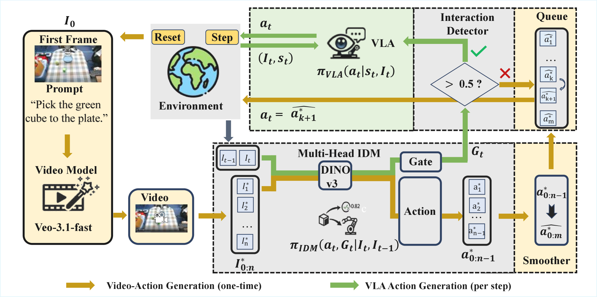

# Veo-Act: How Far Can Frontier Video Models Advance Generalizable Robot Manipulation?

## Basic info

* Title: Veo-Act: How Far Can Frontier Video Models Advance Generalizable Robot Manipulation?
* Authors: Zhongru Zhang, Chenghan Yang, Qingzhou Lu, Yanjiang Guo, Jianke Zhang, Yucheng Hu, Jianyu Chen
* Year: 2026
* Venue / source: arXiv
* Link: https://arxiv.org/abs/2604.04502
* Date surfaced: 2026-04-07
* Why selected in one sentence: It asks a good non-hype question about whether frontier video models can actually help robot manipulation, then lands on a credible decomposition instead of pretending the planner solved control.

## Quick verdict

* Useful

This is a more valuable paper than the title initially suggests because it does not overclaim. The useful conclusion is not "video models solve robotics now" but "video models are already decent semantic planners, yet still too sloppy for contact-accurate low-level control." That decomposition pressure is genuinely helpful for how embodied systems should currently be built and evaluated.

## One-paragraph overview

The paper probes a simple idea: if a frontier video model can imagine a task-completing future from the current robot observation and language instruction, maybe an inverse dynamics model can turn that imagined visual trajectory into actions. In zero-shot form, that mostly works only at a coarse task level. Their main contribution is therefore Veo-Act, a hierarchical pipeline where the video model acts as a high-level motion planner, a multi-head inverse dynamics model turns generated frames into an action chunk and predicts an interaction gate, and a separate VLA policy takes over during dexterous contact-heavy phases. The point is less the specific implementation than the decomposition boundary it argues for.

## Model definition

### Inputs
The system takes an initial robot observation image, a language instruction, and robot state. During execution it also consumes real-time observations for interaction detection and low-level VLA control.

### Outputs
The video model outputs a future visual trajectory. The inverse dynamics model outputs both a chunk of robot actions and a scalar interaction gate. The VLA low-level policy outputs reactive low-level actions when the system switches into interaction mode.

### Training objective (loss)
From accessible text, the multi-head IDM is trained end-to-end with Huber loss for action regression and binary cross-entropy for the interaction detector. The low-level VLA baseline is a pretrained policy. The paper does not present Veo-3 itself as trainable here; it is used as an external frontier video generator.

### Architecture / parameterization
A hierarchical hybrid stack: external video generation model for high-level planning, DINOv3-based multi-head inverse dynamics model for action and gate prediction, and a VLA policy such as pi-zero-point-five as the low-level executor.

## Key questions this summary must address

### 1. What problem is the paper trying to solve?
Robotic manipulation needs both broad semantic generalization and precise low-level control. Current VLA models often lose some generalization when adapted from VLMs into action-producing policies, while video-generation models may preserve stronger world knowledge but are too inaccurate to directly execute contact-rich behavior.

### 2. What is the method?
The method first prompts Veo-3 to generate a task-completion video from the current observation and instruction. A learned inverse dynamics model converts that imagined visual trajectory into an executable action chunk and predicts whether the robot is entering a contact-heavy interaction regime. When the gate fires, control switches from planned action playback to a separate low-level VLA policy; when the gate drops, the system can resume the remaining planned chunk.

### 3. What is the method motivation?
The authors think video models preserve more of the semantic and physical prior learned during large-scale pretraining because they stay in their native image-to-video interface. But those models are still too imprecise for dexterous control. So the natural compromise is to let video generation handle coarse planning while a policy specialized for control handles the fine motor part.

### 4. What data does it use?
For the multi-head IDM, the paper reports 300k frame-pair simulation samples, 100k random-motion simulation samples, and 150k real-world samples on a dexterous-hand platform. It evaluates in both simulation and a real robot setting with a 7-DoF arm, 12-DoF dexterous hand, and RGB cameras.

### 5. How is it evaluated?
The evaluation stresses instruction following and overall task success under confounding conditions designed to hurt a baseline VLA policy: wrist-camera invisibility, similar-object distractors, pass-by interactions, and richer semantic scenes. That is much better than evaluating only on clean in-distribution pick-and-place.

### 6. What are the main results?
The paper claims Veo-Act improves the average success rate of a strong VLA baseline from 45 percent to 80 percent across its simulated and real dexterous-hand settings. The more important qualitative result is that pure video-plus-IDM gives roughly correct task trajectories but insufficient low-level accuracy, while the hierarchical switch improves reliability.

### 7. What is actually novel?
The real contribution is not "use a video model in robotics" by itself. It is the explicit claim and supporting evidence that frontier video models are already useful as high-level semantic planners, but should be insulated from direct low-level control by an interaction-aware execution stack.

### 8. What are the strengths?
The paper asks the right question. It does not confuse plausible video futures with executable robot control. The decomposition is intuitive, and the evaluation tries to expose semantic failure modes rather than just collect clean-tabletop wins. The interaction gate is also a practical idea for deciding when a coarse plan should yield to reactive control.

### 9. What are the weaknesses, limitations, or red flags?
A lot depends on access to a closed frontier video model, which weakens reproducibility. The setting is still a particular dexterous manipulation platform rather than a broad robot benchmark sweep. And the reported gain is hard to decompose cleanly into how much comes from the video prior, the IDM, the switch logic, or task-specific tuning.

### 10. What challenges or open problems remain?
How to make the planner-controller boundary learnable rather than hand-designed. How to recover tighter alignment between imagined trajectories and executable control. How to reduce dependence on proprietary video systems. And how to generalize the switch logic beyond a binary interaction detector.

### 11. What future work naturally follows?
Open-weight video planners, action-conditioned world models that bridge planning and control more tightly, and richer gating schemes that predict control regime transitions at the level of subgoals or contact phases instead of a single scalar trigger.

### 12. Why does this matter for cabbageland?
Because it offers a clean systems lesson: keep the semantic imagination prior and the precision-control machinery separate until the evidence says they can be merged. That is a much more believable path than pretending one giant multimodal model already does both well.

### 13. What ideas are steal-worthy?
Use strong generative models as high-level planners, not low-level policies. Learn explicit regime switches for when planning should give way to reactive control. Evaluate embodied systems under confounding semantic conditions instead of only smooth benchmark setups.

### 14. Final decision
Keep as adjacent inspiration and baseline-framing material. I would not treat it as a definitive robotics solution, but it is a useful decomposition paper and a good antidote to overclaimy video-model-for-robotics narratives.

### Figure 1

Caption-level takeaway: the paper's useful contribution is the pipeline split itself — imagined trajectory, IDM-produced action chunk plus gate, then low-level VLA takeover for dexterous interaction.
